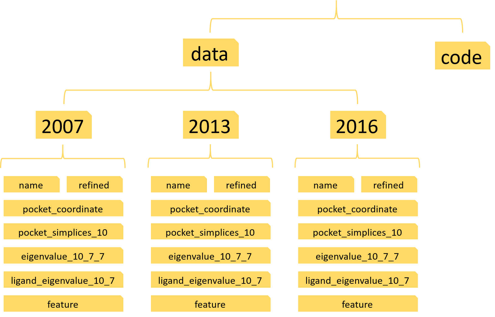

Persistent Spectral Hypergraph
====
    This manual is for the code implementation of paper 'Persistent spectral hypergraph based machine learning (PSH-ML) 
    for protein-ligand binding affinity prediction'
    
****
# Contents
* [1. Software configuration](#Software-configuration)
* [2. Data preparation](#Data-preparation)
* [3. Get the results](#Get-the-results)
* [4. For your model](#For-your-model)

# Software configuration
---
        Platform: Python>=3.6
        Packages needed: math, numpy>=1.18.1, scipy>=1.4.1, scikit-learn>=0.22.1
# Data preparation
In order to make the protein-ligand binding affinity prediction, you need to download the PDBbind data from this
link http://www.pdbbind.org.cn/. To ensure you can use our code easily, you need to build some folders with the
following structure:  

 

Here, three python scripts: PDBbind2007.py, PDBbind2013.py and PDBbind2016.py 
need to be put into the folder ’code’. There are three sub-folders in folder ’data’, which are named as 2007, 2013
and 2016. For each folder(2007 or 2013 or 2016), there are seven sub-folders and a INDEX_refined.data file. This
INDEX_refined.data file helps to build the targets for the supervised learning. The parameter 10 and 7 refer to the
cutoff and filtration value we used. More details about seven folders are as follows:  
* name: we have put three index files in this folder, which gives specific training and testing data information.
* refined: you need to put all the refined entries into this file, 1300 entries for PDBbind-2007, 2959 entries for
PDBbind-2013, 4057 entries for PDBbind-2016. Each entry corresponds a folder named the entry’s name and
this folder contains the protein and ligand files.
* pocket_coordinate: this folder place the coordinate data
* feature: this folder place the feature vectors we construct
* pocket_simplices_10: this folder places the associated simplicial complex of the hypergraph
* eigenvalue_10_7_7: this folder places the complex-based spectral eigenvalues information
* ligand_eigenvalue_10_7: this folder places the ligand-based spectral eigenvalue information
## Remark
* We have constructed these folders with required files. You can clone our project. Then the only thing you need to
do is putting all the entries into the folder ’refined’ for three databases.
* `Further, we have added all the data needed for PDBbind-2007, you can clone our code and run the script
PDBbind2007.py to repeat our results for PDBbind2007. You can take it as an example`
# Get the results
---
If you have successfully insert the PDBbind data and import the packages we mentioned. Then
you can repeat our results by running these three python scripts: PDBbind2007.py, PDBbind2013.py
and PDBbind2016.py.

        `We have added all the needed data into the folder for PDBbind2007, so just clone our project, then you can repeat
        our results for PDBbind2007 by running python script PDBbind2007.py. More specifically, you can run the
        following commands one by one:`
```linux
git clone https://github.com/LiuXiangMath/Persistent-Spectral-Hypergraph.git
```
```linux
cd Persistent-Spectral-Hypergraph
```
```linux
pip install -r requirements.txt
```
```linux
cd code
```
```linux
python PDBbind2007.py
```
# For your model
* You can use our HPS model characterize other interactions, like protein-protein binding affinity, protein-RNA binding affinity and so on. When you apply our model to other problems, you need to extract the corresponding coordinate information by yourself, in other word, you need to rewrite the code that extracting coordinate data. Here the format of coordinate data should be same with ours. The detailed format information can be found in function pocket_coordinate_data_to_file(start,end) in folder "code".
* You can take of our topological descriptors as a representation for protein-ligand binding affinity. So you can combine these descriptors with other machine learning methods or deep learning methods to deal with specific problems.


***

